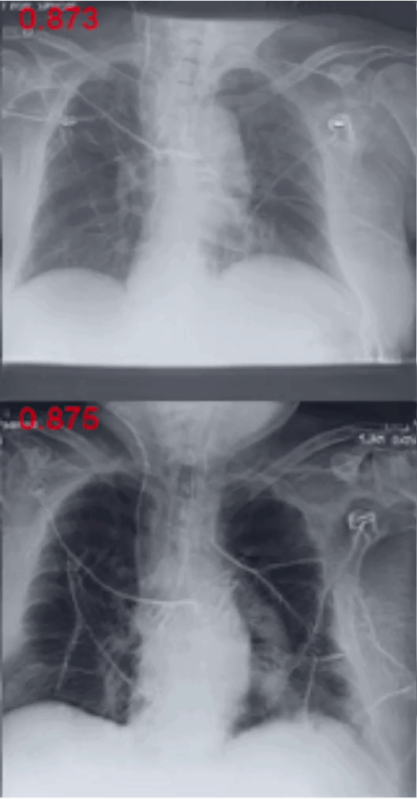
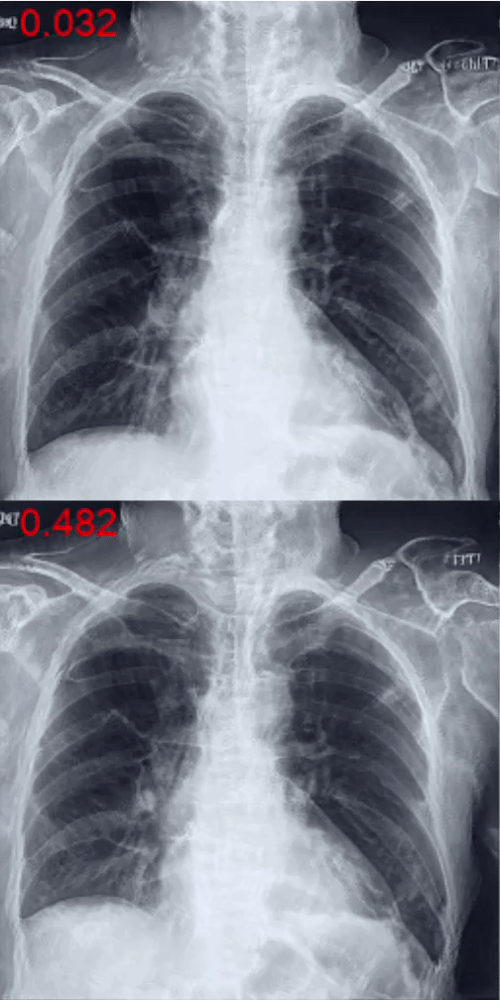

# CheXplaining in Style: Counterfactual Explanations for Chest X-rays

This repository is the official implementation of our paper.

Our GAN-based method creates counterfactual explanations for chest X-rays, by manipulating specific latent directions in
their latent space. 

This repo is also a Pytorch version reimplementation of the [Explaining in Style](https://arxiv.org/abs/2104.13369) paper by Lang et. al. [1]

### Acknowledgements

The StyleGAN2 implementation is based on the code by [rosinality](https://github.com/rosinality/stylegan2-pytorch/). 
The CheXpert dataset processing and classifier is based on the code from the [CheXplain-Dissection](https://github.com/CAMP-eXplain-AI/CheXplain-Dissection) [2]. 
The coordinate search notebook is based on [Explaing in Style](https://github.com/google/explaining-in-style) [1] paper repo. 

### Requirements
1. Python 3.7.11
2. Additionally:
~~~
pip install torch==1.9.0+cu111 torchvision==0.10.0+cu111 -f https://download.pytorch.org/whl/torch_stable.html
pip install lmdb ninja wandb tqdm
pip install git+https://github.com/S-aiueo32/lpips-pytorch.git
~~~
### Preliminaries
1. [Download](https://stanfordmlgroup.github.io/competitions/chexpert/) the CheXpert dataset
2. Convert the CheXpert Dataset to an MDB file using /notebooks/Chexpert_to_MDB.ipynb.
3. Train a binary classifier for a single pathology using /notebooks/CheXpert_classifier.ipynb. The relevant class should be balanced
in order for the method to work properly. The classifier outputs 1x2 array of logits per image.

### Model Training
In order to train the model, run:
~~~
python train.py [dataset_mdb_folder] --arch StyleEx --batch 16 --output_path [output_path]  --classifier_ckpt [model.pth] --wandb --filter_label [label_name] --compare_to_healthy
~~~
You can continue a previously saved training checkpoint with --ckpt.
When using --compare_to_healthy argument, the positive images for the provided labels will be compared to healthy cases with no other pathology.

In order to evaluate the trained model, calculate its FID score:
1. First, calculate the Inception features for the dataset:
~~~
python calc_inception.py [dataset_mdb_folder] --filter_label [label_name] --compare_to_healthy 
~~~
2. Run:
~~~
python fid.py --inception [inception_file.pkl] [gan_checkpoint] 
~~~
You should expect FID score of about 10 for the CheXpert dataset, for this 48K iterations with batch size of 32 images is required.

### Counterfactual generation using StyleSpace Eigenvectors
1. Run Eigendecomposition on the trained model:
~~~
python closed_form_factorization.py [gan_checkpoint] 
~~~
2. In order to generate counterfactuals for images created from noise with label "1" (sick):
~~~
python att_find_eigenvectors.py --ckpt [gan_checkpoint] --classifier_ckpt [model.pth --source noise --factor factor.pt --class_label 1 --cache_name noise_1 --n_sample 200
~~~
3. Similarly, for real images:
~~~
python att_find_eigenvectors.py --ckpt [gan_checkpoint] --classifier_ckpt [model.pth --source data --dataset_path [mdb_folder] --factor factor.pt --class_label 1 --cache_name data_1 --n_sample 200
~~~

Additionally, you can set the degree of change of the image latent along the eigenvector with the --degree argument.

### Counterfactual generation using StyleSpace Coordinate Search
This is based on the method and code of [1].
1. First run att_find_calculate_styles.py to create intermediate files (parameters should be set in the source).
2. Run Explaining_In_Style.ipynb in order to create the counterfactual using StyleSpace coordiantes.

### References
[1] Lang, Oran, et al. "Explaining in Style: Training a GAN to explain a classifier in StyleSpace." Proceedings of the IEEE/CVF International Conference on Computer Vision. 2021.  
[2] Khakzar, Ashkan, et al. "Towards semantic interpretation of thoracic disease and covid-19 diagnosis models." International Conference on Medical Image Computing and Computer-Assisted Intervention. Springer, Cham, 2021.

